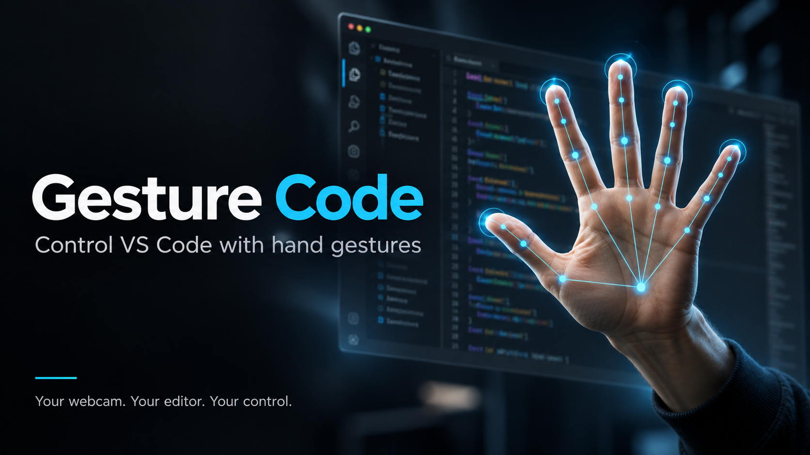

# 🖐️ Gesture Code

> Control VS Code with hand gestures using your webcam

[](https://open-vsx.org/extension/sreeyuthgunnam/gesture-code)
[](https://opensource.org/licenses/MIT)

Gesture Code is a VS Code extension that lets you control your editor using hand gestures captured from your webcam. Perfect for accessibility, presentations, or hands-free coding.



## ✨ Features

- **Real-time Hand Tracking** - Powered by Google's MediaPipe ML library
- **6 Supported Gestures** - Scroll, navigate, comment, save, and more
- **Privacy First** - All processing happens locally, no data sent anywhere
- **Visual Feedback** - See your gestures recognized with hand skeleton overlay
- **Handedness Detection** - Works with both left and right hands

## 🎯 Supported Gestures

| Gesture | Icon | Action |
|---------|------|--------|
| Open Palm | ✋ | Scroll Up |
| Closed Fist | ✊ | Scroll Down |
| Point Up | ☝️ | Move Cursor Up |
| Peace Sign | ✌️ | Toggle Comment |
| Thumbs Up | 👍 | Save File |
| Thumbs Down | 👎 | Close Tab |

## 🚀 Getting Started

### Installation

**From Open VSX (Recommended for VSCodium):**
```bash
ext install sreeyuthgunnam.gesture-code
```

**From VSIX file:**
1. Download the latest `.vsix` from [Releases](https://github.com/sreeyuthgunnam/gesture-code/releases)
2. In VS Code: `Extensions` → `...` → `Install from VSIX`

### Usage

1. Press `Ctrl+Shift+P` to open Command Palette
2. Run **"Gesture Code: Open Tracking Panel"**
3. Click **"Open Browser"** when prompted
4. Allow camera access in your browser
5. Click **"Start Tracking"** and start making gestures!

> **Note:** Due to browser security requirements, the hand tracking runs in your default browser while controlling VS Code via a local server connection.

### Keyboard Shortcut

- `Ctrl+Shift+G` (Windows/Linux) or `Cmd+Shift+G` (Mac) - Toggle gesture tracking

## ⚙️ Configuration

Access settings via `File > Preferences > Settings > Gesture Code`

| Setting | Description | Default |
|---------|-------------|---------|
| `gestureCode.sensitivity` | Detection sensitivity (0.1-1.0) | 0.7 |
| `gestureCode.showOverlay` | Show hand tracking visualization | true |
| `gestureCode.gestureCooldown` | Delay between gestures (ms) | 500 |

## 🔧 How It Works

Gesture Code uses a unique architecture to overcome browser security limitations:

1. **Local HTTP Server** - The extension starts a local server on your machine
2. **Browser-based Tracking** - MediaPipe runs in your browser for camera access and ML inference
3. **WebSocket Communication** - Detected gestures are sent back to VS Code via HTTP POST
4. **Command Execution** - VS Code executes the mapped command for each gesture

```
┌─────────────┐     HTTP      ┌─────────────┐
│   Browser   │ ───────────▶  │   VS Code   │
│  (MediaPipe)│   gestures    │ (Extension) │
│   + Camera  │               │  + Commands │
└─────────────┘               └─────────────┘
```

## 🔒 Privacy

- **100% Local Processing** - Video never leaves your machine
- **No Cloud Services** - MediaPipe runs entirely in your browser
- **No Data Collection** - We don't track or store any information

## 🛠️ Development

### Prerequisites

- Node.js 16+
- VS Code 1.85.0+

### Setup

```bash
# Clone the repository
git clone https://github.com/sreeyuthgunnam/gesture-code.git
cd gesture-code

# Install dependencies
npm install

# Compile
npm run compile

# Launch Extension Development Host
# Press F5 in VS Code
```

### Project Structure

```
gesture-code/
├── src/
│   ├── extension.ts        # Extension entry point
│   ├── commands/           # VS Code command handlers
│   ├── gestures/           # Gesture-to-command mappings
│   ├── managers/           # Core business logic
│   ├── server/             # Local HTTP server + tracking page
│   ├── types/              # TypeScript type definitions
│   └── utils/              # Utility functions
├── media/                  # Icons and assets
└── package.json            # Extension manifest
```

### Building

```bash
# Development build
npm run compile

# Production build
npm run package

# Package as VSIX
npx @vscode/vsce package
```

## 📝 Requirements

- VS Code 1.85.0 or higher (or compatible editor like VSCodium)
- Webcam
- Modern browser (Chrome, Edge, or Firefox)
- Decent lighting for optimal hand detection

## 🐛 Troubleshooting

### Camera not working?
- Ensure camera permissions are granted in your browser
- Check if another app is using the camera
- Try a different browser (Chrome works best)

### Gestures not recognized?
- Ensure good lighting conditions
- Position your full hand clearly in the camera frame
- Try adjusting the sensitivity setting
- Keep your hand 1-2 feet from the camera

### Server not starting?
- Check if another process is using the port
- Try reloading VS Code

## 🤝 Contributing

Contributions are welcome! Please feel free to submit a Pull Request.

1. Fork the repository
2. Create your feature branch (`git checkout -b feature/amazing-feature`)
3. Commit your changes (`git commit -m 'Add amazing feature'`)
4. Push to the branch (`git push origin feature/amazing-feature`)
5. Open a Pull Request

## 📄 License

MIT License - see [LICENSE](LICENSE) for details.

## 🙏 Acknowledgments

- [MediaPipe](https://mediapipe.dev/) - Hand tracking ML library by Google
- [VS Code Extension API](https://code.visualstudio.com/api) - Extension development platform

---

**Made with ❤️ by [Sreeyuth](https://github.com/sreeyuthgunnam)**
